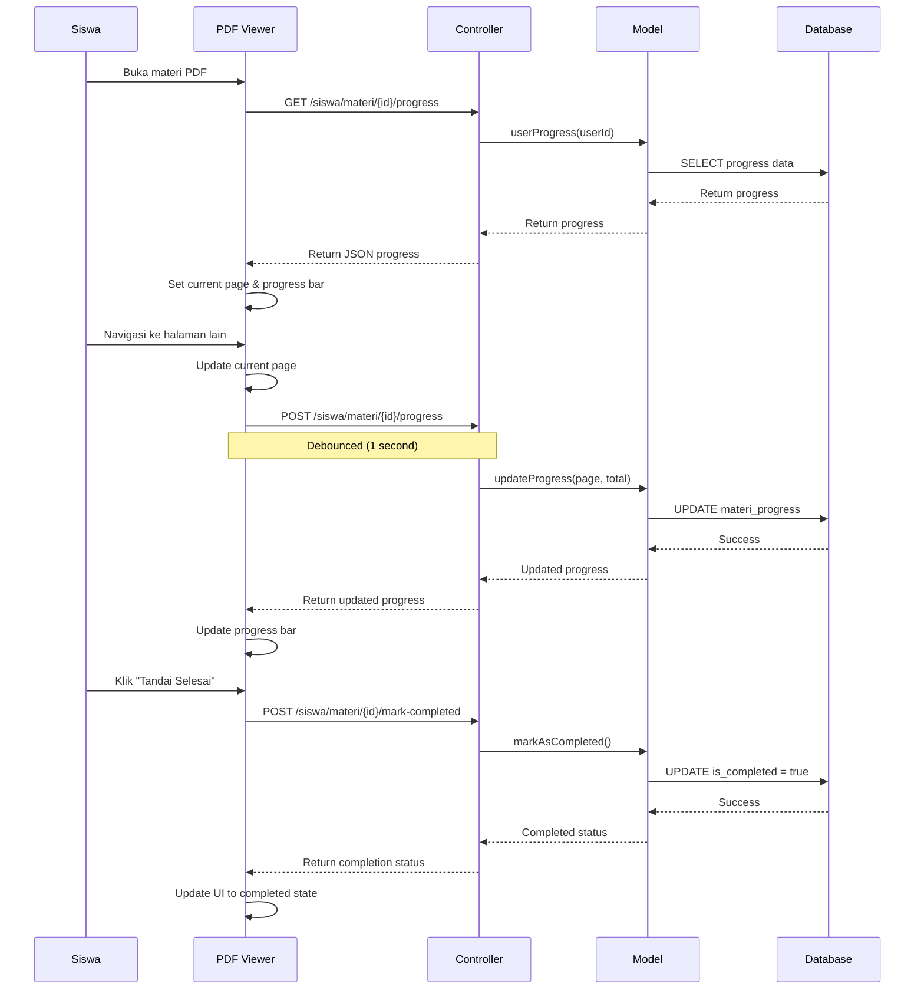
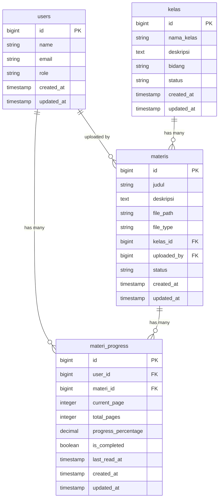
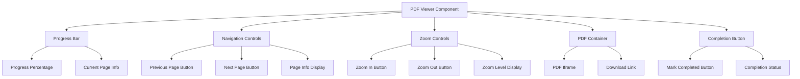

# Arsitektur PDF Viewer & Pelacakan Progres

## Diagram Arsitektur Sistem

```mermaid
graph TB
    subgraph "Frontend Layer"
        A[Siswa Dashboard] --> B[Daftar Materi]
        B --> C[PDF Viewer Component]
        C --> D[Progress Bar]
        C --> E[Navigation Controls]
        C --> F[Zoom Controls]
    end
    
    subgraph "Backend Layer"
        G[SiswaController] --> H[MateriProgressController]
        H --> I[MateriProgress Model]
        I --> J[Database: materi_progress]
        K[Materi Model] --> I
        L[User Model] --> I
    end
    
    subgraph "Database Schema"
        J --> M[user_id]
        J --> N[materi_id]
        J --> O[current_page]
        J --> P[total_pages]
        J --> Q[progress_percentage]
        J --> R[is_completed]
        J --> S[last_read_at]
    end
    
    subgraph "API Endpoints"
        T[POST /siswa/materi/{id}/progress]
        U[GET /siswa/materi/{id}/progress]
        V[POST /siswa/materi/{id}/mark-completed]
    end
    
    C --> T
    C --> U
    C --> V
    T --> H
    U --> H
    V --> H
```

## Flow Diagram - Proses Pelacakan Progres



## Database Schema



## Component Structure



## API Response Examples

### GET Progress Response
```json
{
    "success": true,
    "progress": {
        "current_page": 5,
        "total_pages": 20,
        "progress_percentage": 25.00,
        "is_completed": false,
        "last_read_at": "2025-09-22T10:30:00Z"
    }
}
```

### POST Progress Update Response
```json
{
    "success": true,
    "progress": {
        "current_page": 6,
        "total_pages": 20,
        "progress_percentage": 30.00,
        "is_completed": false,
        "last_read_at": "2025-09-22T10:35:00Z"
    }
}
```

### POST Mark Completed Response
```json
{
    "success": true,
    "message": "Material marked as completed",
    "progress": {
        "current_page": 20,
        "total_pages": 20,
        "progress_percentage": 100.00,
        "is_completed": true,
        "last_read_at": "2025-09-22T10:40:00Z"
    }
}
```
